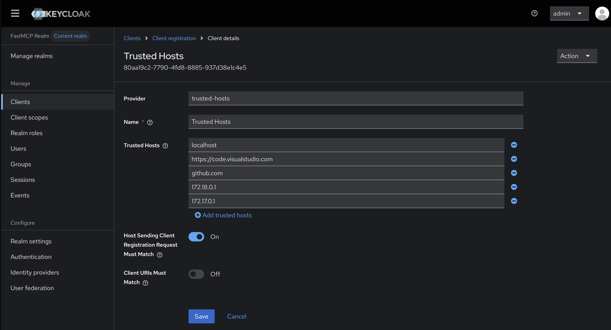
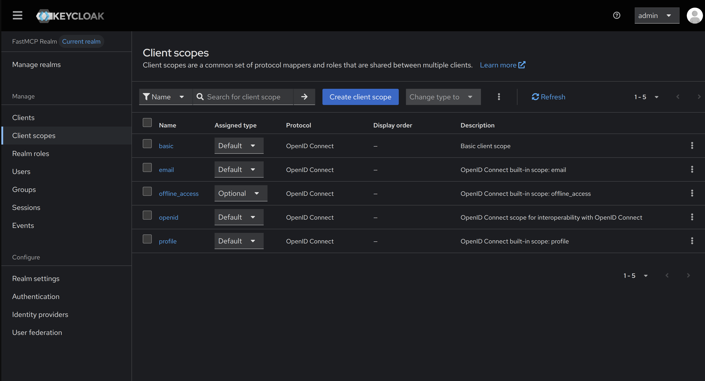

# Authentication Setup

Authentication setup of the MCP server in different scenarios.

## Overview

In order to make requests requiring authentication at OBP-API, the MCP client you are connecting needs to be authenticated. The Open Bank Project MCP server supports multiple authentication methods for different scenarios.

### No Auth
If you simply want to test if the server is working, without any particular view for making authenticated OBP-API requests, just set `ENABLE_OAUTH=false` and connect to the MCP server as normal. Useful for development if you aren't testing consent mechanisms/authentication/authorization.

### Bearer Auth Config (Opey Setup)

**Use Case: Internal systems that can delegate the authentication to the user-agent. i.e. Opey running behind the OBP-Portal**

```
    ┌──────────────┐     OAuth Flow      ┌──────────────┐
    │   Browser    │────────────────────▶│  OBP-OIDC    │
    │  (Frontend)  │◀────────────────────│  (IdP)       │
    └──────┬───────┘    access_token     └──────┬───────┘
           │                                    │
           │ HTTP Request                       │
           │ Authorization: Bearer <token>      │
           ▼                                    │
    ┌──────────────┐                            │
    │  Your Agent  │                            │
    │  (Backend)   │                            │
    └──────┬───────┘                            │
           │                                    │
           │ MCP Protocol                       │
           │ Authorization: Bearer <token>      │
           ▼                                    │
    ┌──────────────┐    Validate via JWKS       │
    │  OBP-MCP     │────────────────────────────┘
    │  Server      │
    └──────────────┘
```

For this you must set your environemnt to.
> Note that you must set one or both of the `KEYCLOAK_REALM_URL` or `OBP_OIDC_ISSUER_URL` and the MCP server will intelligently route to the right provider in order to verify the bearer token.
```
ENABLE_OAUTH=true

AUTH_PROVIDER=bearer-only

KEYCLOAK_REALM_URL="Your keycloak realm url"
OBP_OIDC_ISSUER_URL="Your OBP-OIDC url"
```

Then in Opey's `mcp_servers.json`:
```json
{
  "servers": [
    {
      "name": "obp",
      "url": "http://0.0.0.0:9100/mcp",
      "transport": "http",
      "requires_auth": true
    }
  ]
}
```

### Keycloak and OBP-OIDC Providers

**Use Case: An external MCP Client such as VSCode Copilot Chat/Claude Desktop/ZED/Cursor**

External or third-party MCP clients will need a Dynamic Client Registration-enabled OAuth 2 provider

Depending on your instance of OBP, you may have either/or Keycloak and/or OBP-OIDC OAuth 2 providers available to you. You must configure which provider you want the MCP server to authenticate against. Both of these servers support dynamic client registration as is standard for OAuth servers providing auth to MCP servers. 

In order to enable OAuth, you must set the following environment variables:

```env
ENABLE_OAUTH=true

BASE_URL="http://localhost:9100" # The URL of the OBP-MCP server (usually localhost for dev.)
```

Then see below for provider specific configs:

#### Keycloak Configuration

```env
AUTH_PROVIDER=keycloak

KEYCLOAK_REALM_URL="http://localhost:8000/realms/obp-mcp" # URL of your DCR-enabled realm
```
Dynamic Client Registration is not enabled out of the box for keycloak, so you will need to configure your master realm or create a new realm specifically for OBP-MCP (recommended).

First thing to do is to configure `trusted hosts` in order to allow registration from an allowed lists of domains. 



Also make sure you uncheck "Client URIs Must Match".

Depending on your MCP client, you may need to fiddle with the client scopes, as some MCP clients can request non-standard scopes. 



#### OBP-OIDC Configuration

On the OBP-OIDC's side, all you need to do is set 
```env
ENABLE_DYNAMIC_CLIENT_REGISTRATION=true
```
before starting up OBP-OIDC

Then in the env we need to set
```env
AUTH_PROVIDER=obp-oidc

OBP_OIDC_PROVIDER_URL="http://localhost:9000/obp-oidc"
```